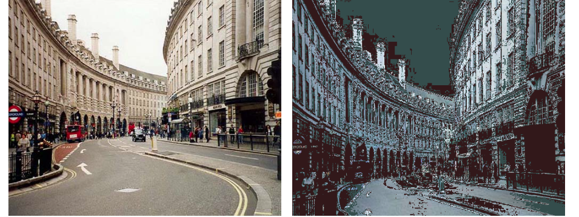

# Chameleon

Light weight image uitll with custom shader support


### dev build
`npx webpack --mode development`


### package local build
`npm pack`

### Generate .d.ts files from *.js
`npx tsc --declaration --outDir dist src/*.js src/**/*.js --allowJs`

### Usage
```
import shaderBinder from '@asanka-npm/chameleon';

shaderBinder(
    name, 
    canvas,
    {
      vertex: `vertex shader code`,
      fragment: `fragment shader`
    }
);

```

